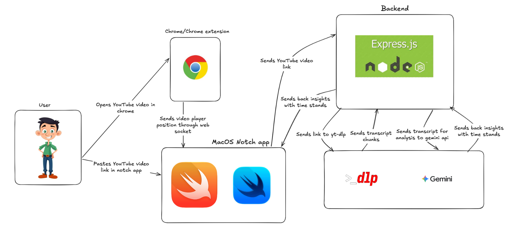

# CounterNotch

CounterNotch is a macOS discussion companion that turns the MacBook notch into
a real-time argument analysis surface. Give it a YouTube discussion or debate,
and it retrieves the captions, analyzes the complete transcript with Gemini,
then displays timestamped insights as the video plays.

The project is built as a hackathon extension of the open-source
[Boring Notch](https://github.com/TheBoredTeam/boring.notch) macOS app.

## What it does

- Accepts a public YouTube video URL from the macOS notch interface.
- Retrieves timed captions with `yt-dlp`.
- Sends the complete transcript to Gemini in one request, preserving context
  across the full discussion.
- Identifies unsupported claims, contradictions, possible strawmen, evasions,
  and missing premises.
- Returns grounded findings tied to real transcript segment IDs and timestamps.
- Tracks YouTube playback through a Manifest V3 Chrome extension.
- Displays an insight card when playback naturally reaches its trigger time.
- Handles pausing, seeking, rewinding, video changes, event deduplication, and
  short insight queues.
- Caches completed analyses for 24 hours.

## System design



The diagram shows the conceptual product flow. In the current implementation,
the backend uses Node.js's native HTTP server rather than Express, and the
Chrome extension sends playback state through Chrome Native Messaging rather
than a WebSocket.

There are two paths through the system:

1. **Analysis path:** the SwiftUI app sends a YouTube URL to the local API. The
   API retrieves and normalizes captions, sends the full transcript to Gemini,
   validates the structured response, and returns timestamped insight events.
2. **Playback path:** the Chrome extension observes the active YouTube player
   and forwards its video ID, current time, paused state, duration, and playback
   rate through a Swift native messaging host to the macOS app.

The timeline engine combines both paths and presents an insight only when the
matching video naturally crosses that insight's trigger time.

## Tech stack

### macOS app

- Swift
- SwiftUI
- Combine
- Xcode
- Swift Package Manager

### Browser integration

- Google Chrome 116+
- Manifest V3 Chrome extension
- JavaScript ES modules
- Chrome Native Messaging
- Swift native messaging host
- `DistributedNotificationCenter`

### Backend and AI

- Node.js 20.10+
- JavaScript with ES modules
- Native Node.js HTTP server
- REST and JSON
- JSON Schema validation
- `yt-dlp` for YouTube captions
- Google Gemini API
- Gemini 3.5 Flash-Lite by default
- In-memory transcript and analysis caches

## How it works

```text
YouTube URL
    -> local Node.js analysis API
    -> yt-dlp caption retrieval
    -> normalized timestamped transcript
    -> one full-transcript Gemini request
    -> validated insight timeline
    -> SwiftUI macOS app

YouTube player
    -> Chrome content script
    -> extension service worker
    -> Chrome Native Messaging
    -> Swift native host
    -> playback timeline engine
    -> notch insight card
```

## Requirements

- macOS 14 Sonoma or later
- Xcode 16.4 or later
- Node.js 20.10 or later
- npm
- Google Chrome 116 or later
- [`yt-dlp`](https://github.com/yt-dlp/yt-dlp)
- A Gemini API key for live analysis

Install `yt-dlp` with Homebrew:

```sh
brew install yt-dlp
```

## Setup

### 1. Clone and configure

```sh
git clone https://github.com/AlNaheyan/ctp-hack.git
cd ctp-hack
npm install
cp .env.example .env
```

For live analysis, update `.env`:

```dotenv
ANALYSIS_MODE=live
PORT=3000
HOST=127.0.0.1
GEMINI_API_KEY=replace-with-your-key # lint-allow-secret
LOG_PAYLOADS=false
```

Never commit `.env` or expose the Gemini API key in the extension or macOS app.

### 2. Load the Chrome extension

1. Open `chrome://extensions`.
2. Enable **Developer mode**.
3. Click **Load unpacked**.
4. Select the repository's `extension/` directory.

After editing extension code, click **Reload** on its extension card and refresh
the YouTube page. Unpacked extensions do not automatically reload themselves.

### 3. Start the analysis API

Run the API separately in its own terminal:

```sh
PORT=3000 npm run api
```

Verify it:

```sh
curl http://127.0.0.1:3000/healthz
```

### 4. Build and launch CounterNotch

In another terminal:

```sh
sh run.sh
```

The script:

- finds the unpacked extension in the normal Chrome profile;
- builds and registers the Swift native messaging host;
- builds the macOS app;
- replaces the previous app instance;
- launches the app; and
- opens YouTube in the normal Chrome profile.

The API remains a separate process and is not started or stopped by `run.sh`.

## Usage

1. Expand CounterNotch.
2. Paste a public YouTube discussion or debate URL.
3. Select **Analyze** and wait for the timeline to finish processing.
4. Open the same video in Chrome and begin playback.
5. CounterNotch displays argument insights as their timestamps are crossed.

## Development commands

| Command | Purpose |
| --- | --- |
| `PORT=3000 npm run api` | Start the analysis API |
| `npm run dev` | Start the API in the configured development mode |
| `npm run mock` | Run the deterministic fixture server |
| `npm run analyze` | Analyze the golden transcript with the offline provider |
| `npm run analyze -- --live` | Analyze a transcript using Gemini |
| `npm test` | Run backend and extension tests |
| `npm run lint` | Parse, policy, and credential checks |
| `npm run smoke` | Run the local mock smoke test |
| `npm run native:register -- <extension-id>` | Register the native messaging host manually |
| `npm run native:unregister` | Remove the native messaging host registration |

## API

The local API listens on `127.0.0.1` and exposes:

| Method | Route | Purpose |
| --- | --- | --- |
| `GET` | `/healthz` | Health, mode, model, and cache information |
| `POST` | `/v1/analyze` | Analyze a YouTube URL or video ID |
| `GET` | `/v1/analysis/:videoId` | Retrieve a cached analysis |

Example:

```sh
curl -X POST http://127.0.0.1:3000/v1/analyze \
  -H "content-type: application/json" \
  -d '{"url":"https://www.youtube.com/watch?v=VIDEO_ID"}'
```

See [the API reference](docs/api/analysis-api.md) and
[local setup guide](docs/setup/local-stack.md) for the complete contracts and
configuration options.

## Repository structure

```text
boringNotch/                 SwiftUI macOS application
Packages/DiscussionTimeline Analysis loading, cache, timeline, and event queue
Packages/NativeMessagingHost Swift Chrome native messaging bridge
extension/                   Manifest V3 playback observer
backend/                     Transcript ingestion and Gemini analysis API
contracts/                   Versioned JSON schemas
fixtures/                    Deterministic test transcripts and analyses
docs/                        Architecture, API, setup, and UX documentation
scripts/                     Development and native-host utilities
run.sh                       Build, register, and launch the macOS stack
```

## Project team

- Evan (`Evandabest`)
- Al Naheyan (`AlNaheyan`)
- Hamet Coulibaly (`hamet-c`)
- Maisha Tasnim Chowdhury

## Attribution

CounterNotch is based on
[Boring Notch](https://github.com/TheBoredTeam/boring.notch). We are grateful
to its authors and contributors for the macOS notch foundation. Existing
third-party notices are preserved in
[THIRD_PARTY_LICENSES](THIRD_PARTY_LICENSES).

## License

This repository is licensed under the [GNU GPL v3](LICENSE).
