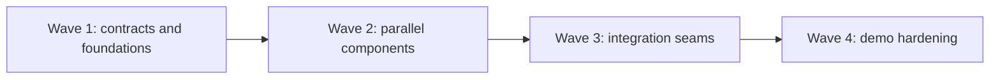

# Discussion Analyzer Hackathon Roadmap

This roadmap turns the discussion analyzer into four dependency-ordered waves. Each wave contains four tickets designed to be owned in parallel by four people. Start a wave only after the exit gate of the preceding wave is met.

## Hackathon scope

- Input: one public YouTube watch URL.
- Browser: Google Chrome only.
- Player clock: YouTube's live `<video>` element; the Mac app never runs its own playback clock.
- AI: a backend transcript-and-analysis pass that returns timestamped argument insights.
- Playback path: Chrome content script -> extension service worker -> Chrome native messaging -> macOS app -> local timeline matcher -> notch card.
- Runtime rule: the backend is not in the playback synchronization loop.
- Cache: analysis results are reusable for 24 hours, with an explicit refresh path.
- Demo target: one known video plus one unseen public video.

## System boundary

```text
                         PROCESS ONCE
YouTube URL -> API -> transcript -> analyzer -> timestamped JSON
                  |                              |
                  +--------- 24 h cache --------+
                                                 |
                                                 v
                                           macOS timeline

                          OBSERVE LIVE
YouTube <video> -> Chrome extension -> native messaging -> macOS timeline
                                                            |
                                                            v
                                                        notch card
```

The key invariant is: **the player owns time; the app observes time**.

## Delivery graph



| Wave | Goal | Tickets | Exit gate |
| --- | --- | --- | --- |
| [1](wave-1-foundations.md) | Freeze contracts and prove the fork builds | `W1-T1`–`W1-T4` | Build baseline, schemas, fixtures, UX states, and local runbook are reviewed |
| [2](wave-2-components.md) | Build every major component against fixtures | `W2-T1`–`W2-T4` | Transcript, analyzer, extension, and Mac timeline pass fixture-driven tests |
| [3](wave-3-integration.md) | Connect the components at stable seams | `W3-T1`–`W3-T4` | URL-to-cards and playback-to-card paths work independently |
| [4](wave-4-demo.md) | Make the full demo reliable and distributable | `W4-T1`–`W4-T4` | A clean Mac can run the scripted demo twice without manual repair |

Each ticket above has its own contributor document. Use the [four-person integration strategy](merge-strategy.md) and the merge playbook linked from each wave before advancing to the next wave.

## Suggested four-person assignment

This keeps context reasonably stable while rotating the integration burden. Replace Person A–D with names in your team notes.

| Person | Wave 1 | Wave 2 | Wave 3 | Wave 4 |
| --- | --- | --- | --- | --- |
| A — macOS/platform | W1-T1 | W2-T4 | W3-T2 | W4-T3 |
| B — backend/data | W1-T2 | W2-T1 | W3-T1 | W4-T2 |
| C — AI/product UI | W1-T3 | W2-T2 | W3-T3 | W4-T4 |
| D — browser/integration | W1-T4 | W2-T3 | W3-T4 | W4-T1 |

The person assigned W4-T1 is the final integration lead. For Waves 1–3, choose a wave integrator from someone whose own package has already passed review; integration begins only after all four package pull requests are ready.

## Shared API contract target

Wave 1 owns the exact schema. Downstream tickets should expect this shape, not invent alternatives:

```json
{
  "schemaVersion": 1,
  "videoId": "dQw4w9WgXcQ",
  "title": "Example discussion",
  "generatedAt": "2026-08-27T16:00:00Z",
  "expiresAt": "2026-08-28T16:00:00Z",
  "events": [
    {
      "id": "evt_001",
      "startTime": 338.2,
      "triggerTime": 342.8,
      "endTime": 349.1,
      "speaker": "Speaker A",
      "type": "unsupported_claim",
      "title": "Claim needs support",
      "summary": "A numerical claim is made without evidence.",
      "confidence": 0.91,
      "evidence": "Short transcript excerpt or paraphrase"
    }
  ]
}
```

Playback messages use a separate, small contract:

```json
{
  "schemaVersion": 1,
  "type": "PLAYBACK_STATE",
  "payload": {
    "videoId": "dQw4w9WgXcQ",
    "currentTime": 342.91,
    "duration": 1250.4,
    "paused": false,
    "playbackRate": 1.0,
    "observedAt": "2026-08-27T16:03:42.100Z"
  }
}
```

## Team rules

- One ticket, one branch, one owner, and preferably one pull request.
- Treat `triggerTime` as the notification point; use `startTime` and `endTime` for context and UI.
- Match crossings (`previousTime < triggerTime <= currentTime`), never floating-point equality.
- Treat an absolute playback delta over 2 seconds as a seek and reset by binary search without replaying skipped events.
- Dedupe cards by `(videoId, event.id)` until rewind crosses before that event or the video changes.
- Keep secrets on the backend. No Gemini key may appear in the extension or app bundle.
- Make tests deterministic with checked-in fixtures; live YouTube and Gemini calls are integration tests only.

## Scope cuts, in order

If time runs short, cut these without changing the contracts:

1. Multiple analysis providers and model selection.
2. Insight history and rich card interactions.
3. Polished installer automation; use a documented local install.
4. Unseen-video demo; retain the known cached demo.

Do not cut crossing-based playback matching, seek handling, schema validation, or a cached demo fixture. Those are the reliability core.

## Repository notes

The codebase is based on [TheBoredTeam/boring.notch](https://github.com/TheBoredTeam/boring.notch/) and retains its GPL-3.0 license obligations. `origin` is the hackathon repository; `upstream` tracks Boring Notch. Keep upstream merges isolated from product feature branches.
